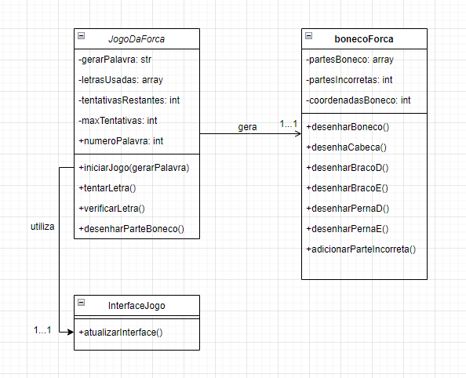
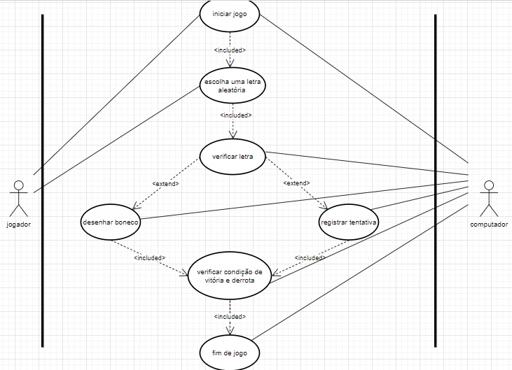

# JogodaForca2023
Este projeto é um jogo da forca feito com Javascript onde tem um banco de palavras próprio e dicas para o jogador.

## Código Explicado
### HTML
No HTML, foi definido inicialmente o idioma do projeto, sendo este português brasileiro. No cabeçalho da página tem: a permissão para caracteres especiais, os links para colocar ícone na página e css e o título da página. No corpo, inicialmente é definido que todos os objetos serão alinhados no centro, e possui uma div, da classe jogoForca, e um link para o Javascript. Na div, um H1 com o id "descriçaõ" é colocado, o canvas com o id "forca" em seguida é definido com altura, largura e define o tamanho da borda e um H2 com o id "dicas" também é colocado.

### JavaScript
Várias lets são definidas no início sendo elas: palavras (essa let possui as palavras que o usuário precisa acertar), qntErros (quantidade de erros do usuário), acertos (quantidade de acertos do jogador), tentativas (as tentativas que o usuário fez), palavraSecreta (define que a aleatoriedade das palavras) e mudarDescricao (let que é ligada ao H1 com um getElementById). Duas constantes são definidas em seguida: a canvas (é ligada ao canvas com um getElementById) e a ctx (que é ligada à const canvas).

São chamadas funções que desenham os detalhes do jogo (o poste, a corda, a base e os traços com a quantidade de letras da palavra). Uma função chamada teclaPressionada é definida onde vai ver se uma tecla foi pressionada e se foi um acerto ou um erro, adicionando uma tentativa independente de ter acertado ou não chamando a função addTentativa, e no fim chama a função verificaFimjogo (que checa se o boneco foi desenhado completamente ou se a palavra foi concluída). A função desenharBoneco é feita considerando a quantidade de erros e com a quantidade dos erros, é chamadaa função de desenhar uma parte do boneco.

Um evento é definido para que, quando a tecla K é apertada. Em seguida, a let dicas é definida para as dicas e uma outra let chamada "dica" liga as dicas com a palavraSecreta. Por fim, a let mudarDica é ligada com o H2 por um getElementById e um innerHTML muda a dica.

## Diagramas

## Autores
Mariana Santiago e Yuri Telis